# Game design - C-crits

_You have to fight a war using your ancient robot army of C-crits. Sadly, the C compiler for these critters has been long lost, so you'll need to program them in crasm, their assembly language._

## Gameplay

The main gameplay loop is:

- Observe the game state playing out in the main window
  - Critters are automatically spawned into a starting state
- Write a _state handler_ snippet in crasm using the editor window
  - State handlers are small programs that can execute actions and transition to other states
- Deploy it to the critters & watch them win on your behalf!

I want it to be fun because it's open-ended problem solving, not simply "guess the designer's solution", and satisfying to watch the critters execute your plan.

### _Candidate objectives_

- Capture the flag
- Destroy the enemy base or all enemies
- Survive for a certain amount of time
- Destroy enough enemy critters in a given time

### _Candidate critter types (implies game setting & art style)_

- Bug-like robots with 6-8 legs, they have a facing direction but can move in any direction
- Heli-bots that have a facing direction, can move in any direction
- Airplanes that have a facing direction, and must always move in that direction, but may control speed
- Generic omnidirectional bots, with no constraints on movement/firing

### _Candidate crasm programming model_

- High-level - set goals that are translated by fixed subsystems into basic control "move to (X,Y)", "attack A"
- Low-level - set basic control commands directly "move forward", "turn left", "fire"
- Do we need registers? Could we just use a hash table? Does it have scope?
- Support subroutines?
- Support loops? Recursion?

---

## Progression

## Levels

## Art

## Sound & Music
